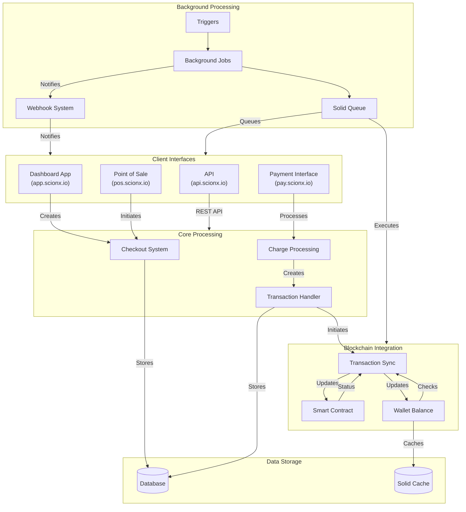

# System Architecture

## System Components

### Client Interfaces
- Dashboard App (app.scionx.io)
- Point of Sale (pos.scionx.io)
- API (api.scionx.io)
- Payment Interface (pay.scionx.io)

### Core Processing
- Checkout System
- Charge Processing
- Transaction Handler

### Background Processing
- Triggers
- Background Jobs
- Solid Queue
- Webhook System

### Blockchain Integration
- Transaction Sync
- Smart Contract
- Wallet Balance

### Data Storage
- Database
- Solid Cache
