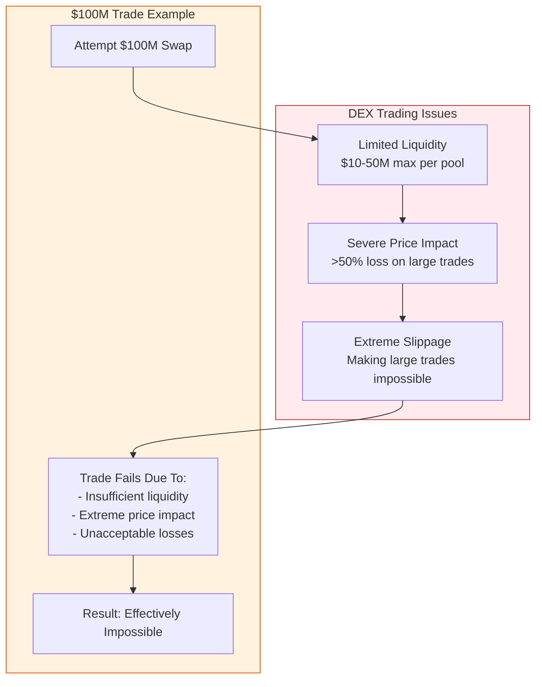
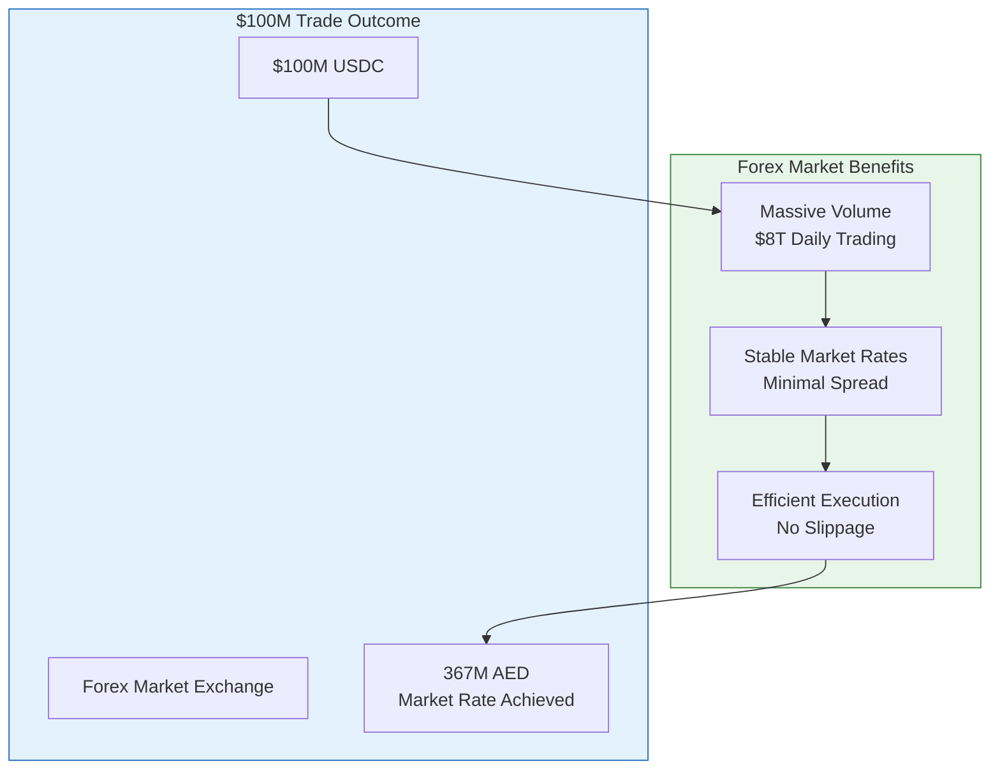
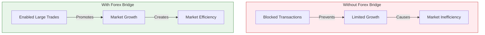

# Why Forex Bridge Matters: Large-Scale USD-AED Exchange

## The Problem: DEX Limitations

## The Solution: Forex Bridge

## Why This Matters

### Current Market Limitations
1. **Liquidity Constraints**
   - DEX pools typically max out at $10-50M
   - Large trades are impossible without massive losses
   - Multiple pools don't solve the problem due to cumulative price impact

2. **Business Impact**
   - Institutional traders cannot execute large positions
   - Market makers can't efficiently manage risk
   - Arbitrage opportunities remain unexploited
   - Overall market inefficiency

### Forex Bridge Advantages

1. **Access to Deep Liquidity**
   - Tap into $8 trillion daily forex market
   - Execute any size trade at market rates
   - No slippage or price impact concerns

2. **Cost Efficiency**
   - Save millions on large trades
   - Example: $100M trade
     - DEX: $50M+ lost to slippage
     - Forex: ~0.15% total cost ($150K)

3. **Market Stability**
   - Reliable execution of large trades
   - Stable prices aligned with forex market
   - Predictable costs and outcomes

## Real-World Impact

