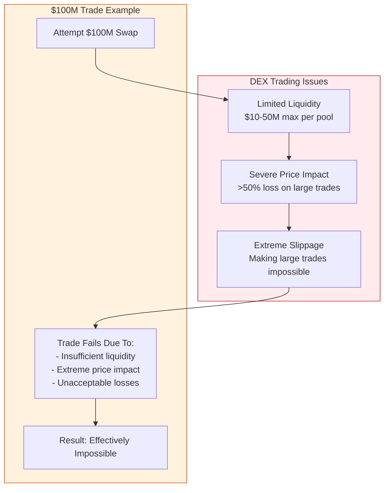
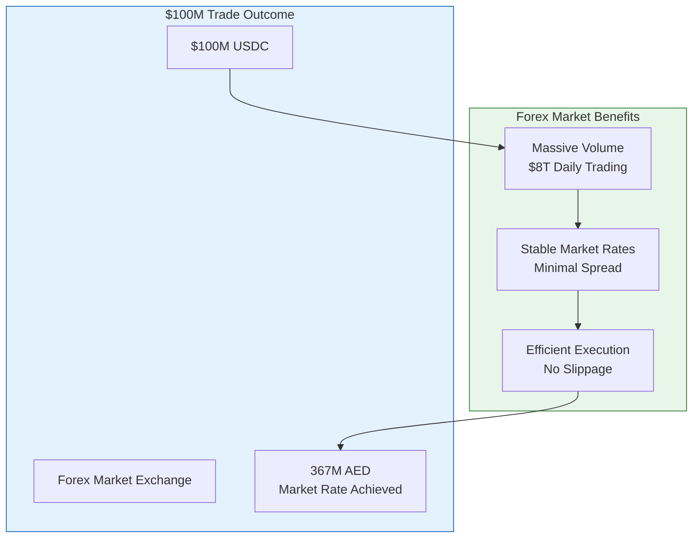
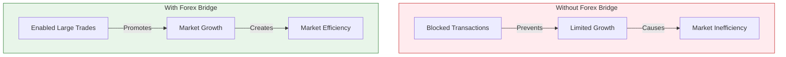

# Why Forex Bridge Matters: Large-Scale USD-AED Exchange

## The Problem: DEX Limitations

### Overview of Current Issues
Decentralized Exchanges (DEXs) have become a cornerstone of modern finance, but they face critical limitations when handling large-scale trades. Institutional and high-net-worth traders are increasingly stymied by these shortcomings, which include limited liquidity, severe price impact, and extreme slippage.

#### Key Challenges:
1. **Liquidity Constraints**:
   - DEX liquidity pools typically cap out at $10-50M, creating a hard limit for trade sizes.
2. **Severe Price Impact**:
   - Large trades result in disproportionate losses, sometimes exceeding 50% of the trade value.
3. **Extreme Slippage**:
   - Slippage makes executing large trades effectively impossible, preventing traders from accessing the market efficiently.

### Real-World Example: $100M Trade
When attempting a $100M trade on a DEX, the following occurs:
- Liquidity pools are insufficient to support the transaction.
- The trade induces extreme price impact, causing unacceptable losses.
- Result: The trade fails or incurs catastrophic inefficiencies, rendering such transactions practically impossible.

### Visualization of DEX Issues

---

## The Solution: Forex Bridge

The Forex Bridge addresses these limitations by leveraging the global forex market's unparalleled liquidity, efficiency, and stability. This solution transforms large-scale crypto-to-fiat trades, such as USD to AED, into seamless, cost-effective transactions.

### Forex Market Benefits
1. **Massive Volume**:
   - The forex market processes $8 trillion in daily trading volume, ensuring unmatched depth.
2. **Stable Market Rates**:
   - Tight spreads and minimal volatility make forex a predictable trading environment.
3. **Efficient Execution**:
   - With no slippage, trades execute precisely at market rates, regardless of size.

### Case Study: $100M Trade
- **Input**: $100M USDC
- **Process**: Conversion via forex market.
- **Output**: 367M AED, achieved at the prevailing market rate.

---

## Why This Matters

### Addressing Current Market Limitations

1. **Liquidity Constraints**:
   - DEX liquidity pools are inherently limited, capping trades at $10-50M.
   - Multiple pools do not solve this issue due to cumulative price impact.
2. **Business Impact**:
   - Institutional traders face insurmountable barriers when attempting large trades.
   - Market makers cannot efficiently manage risk.
   - Arbitrage opportunities remain unexploited, leading to overall market inefficiency.

### Forex Bridge Advantages

1. **Access to Deep Liquidity**:
   - Tapping into the $8 trillion daily forex market ensures trades of any size execute seamlessly.
   - Eliminates concerns over slippage or price impact.

2. **Cost Efficiency**:
   - The forex market drastically reduces trading costs for large transactions.
   - Example: A $100M trade would lose $50M+ on a DEX due to slippage but incurs only ~$150K in forex fees (~0.15%).

3. **Market Stability**:
   - Forex Bridge enables reliable execution of large trades at stable prices.
   - Predictable costs and outcomes foster confidence among institutional traders.

---

## Real-World Impact

The Forex Bridge is transformative, unlocking efficiencies and growth potential for the broader market.

### Without Forex Bridge
- Transactions are blocked due to insufficient liquidity.
- Market inefficiency persists, stifling growth.

### With Forex Bridge
- Large-scale trades become possible, driving market growth.
- Enhanced efficiency benefits all participants, from institutional traders to arbitrageurs.

---

### Conclusion
The Forex Bridge addresses critical inefficiencies in decentralized trading, offering a scalable, cost-effective, and reliable solution for large-scale USD-AED exchanges. By unlocking the power of the $8 trillion daily forex market, it paves the way for a more robust, efficient, and inclusive financial ecosystem.

