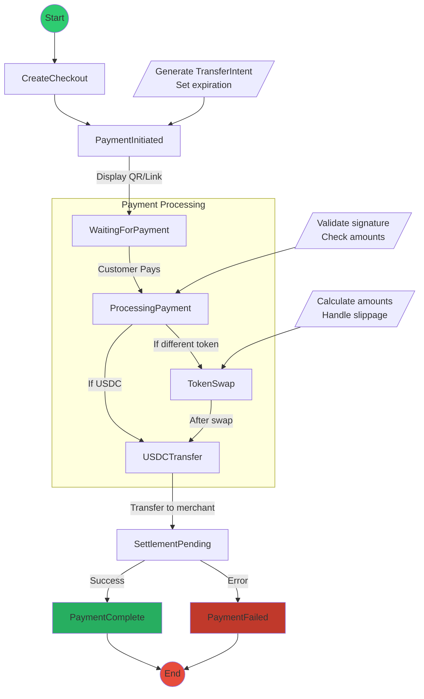

```mermaid
graph TD
    Start((Start)) --> CreateCheckout
    CreateCheckout --> PaymentInitiated
    PaymentInitiated -- "Display QR/Link" --> WaitingForPayment
    
    subgraph Payment Processing
        WaitingForPayment -- "Customer Pays" --> ProcessingPayment
        ProcessingPayment -- "If different token" --> TokenSwap
        ProcessingPayment -- "If USDC" --> USDCTransfer
        TokenSwap -- "After swap" --> USDCTransfer
    end

    Note1[/"Generate TransferIntent<br>Set expiration"/] --> PaymentInitiated
    Note2[/"Validate signature<br>Check amounts"/] --> ProcessingPayment
    Note3[/"Calculate amounts<br>Handle slippage"/] --> TokenSwap

    USDCTransfer -- "Transfer to merchant" --> SettlementPending
    SettlementPending -- "Success" --> PaymentComplete
    SettlementPending -- "Error" --> PaymentFailed
    
    PaymentComplete --> End((End))
    PaymentFailed --> End((End))

    style Start fill:#2ECC71
    style End fill:#E74C3C
    style PaymentComplete fill:#27AE60
    style PaymentFailed fill:#C0392B
```
