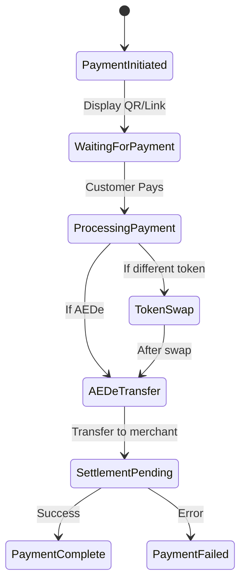

# Payment Flow Documentation

## State Diagram

## State Descriptions

### Initial States
- **PaymentInitiated**: Merchant creates checkout request
- **WaitingForPayment**: System displays payment QR/link to customer

### Processing States
- **ProcessingPayment**: Validates incoming payment
- **TokenSwap**: Converts other tokens to AEDe if needed
- **AEDeTransfer**: Handles AEDe token transfer
- **SettlementPending**: Finalizes merchant settlement

### Final States
- **PaymentComplete**: Transaction successful
- **PaymentFailed**: Transaction failed, requires investigation

## State Transitions
1. Create checkout -> Generate payment link
2. Customer payment -> Process and validate
3. Token conversion -> Handle if needed
4. Settlement -> Transfer to merchant
5. Confirmation -> Update final status
