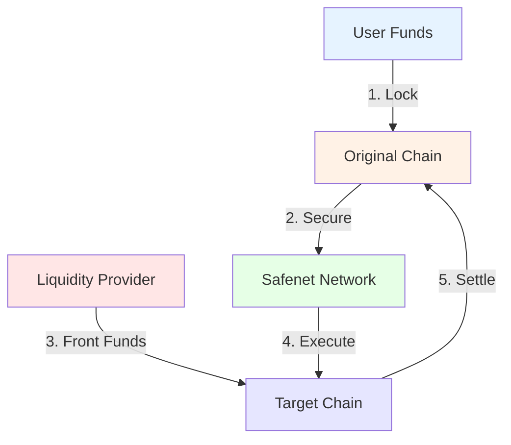

# Safenet

Instant cross-chain transactions without bridging delays while maintaining self-custody.

## Core Features

- Execute transactions on any chain instantly
- Single unified balance across chains
- Self-custody with security guarantees
- Economic incentives ensure safe settlement

## How It Works

## Key Components

1. **Network Actors**
   - Processors: Execute transactions
   - Validators: Monitor security
   - Liquidity Providers: Enable instant spending

2. **Security**
   - Optimistic validity proofs
   - Challenge system for invalid transactions
   - Economic incentives for honest behavior

## Current Status
- Documentation: [Safe Docs](https://docs.safe.global)
