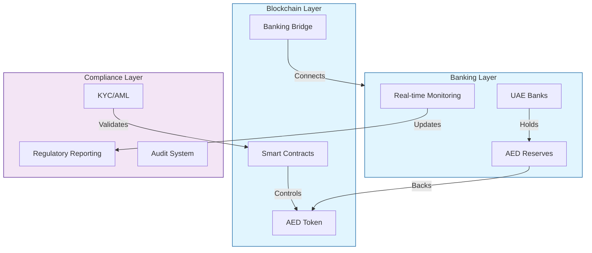
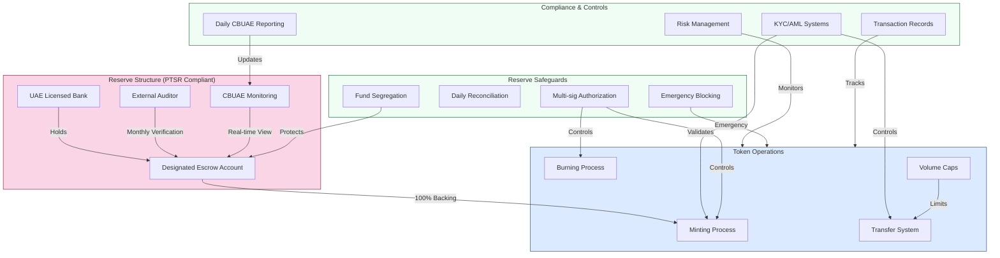
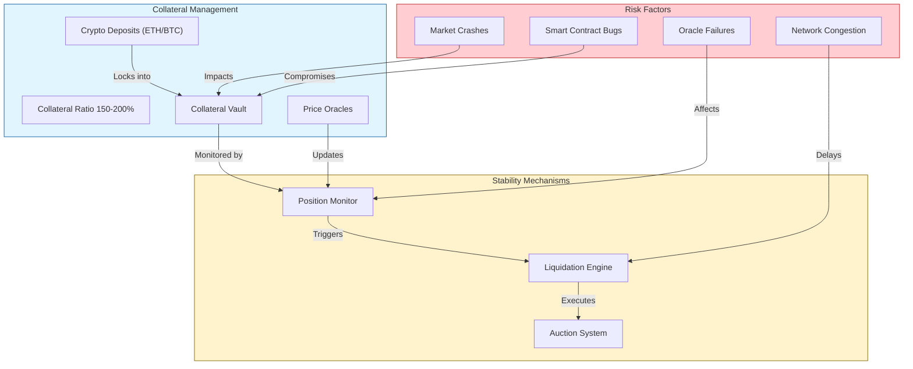
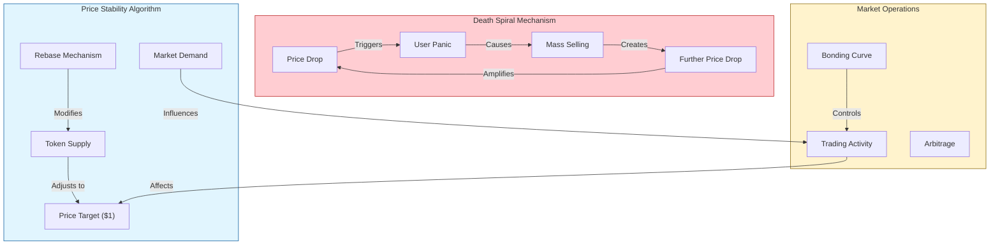
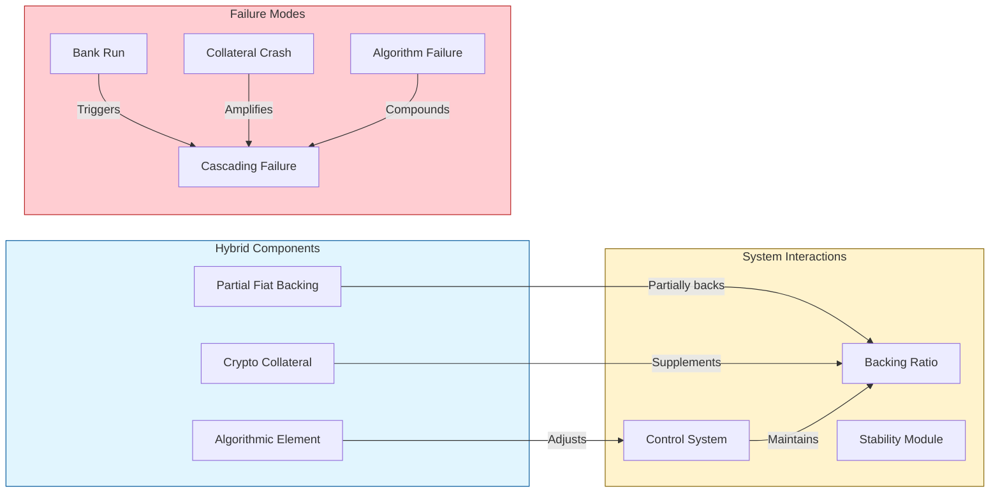

# AED Stablecoin: Design and Implementation Framework

## Core Architecture

The AED stablecoin system consists of three integrated layers:

## Stablecoin Model Analysis

### 1. Fiat-Collateralized Model (Recommended)

This model provides the most stable and regulatory-compliant approach for an AED stablecoin.

Key Implementation Features:
- 100% AED backing in UAE banks
- Multiple banking partnerships
- Independent monitoring
- Monthly attestations
- Public reserve reporting
- Regular security audits

Successful Implementation Examples:

1. USDC (Circle/Coinbase):
   - Maintains 100% reserves in cash and short-term US Treasury bonds
   - Monthly attestations by Grant Thornton
   - Real-world usage: Powers major DeFi protocols like Aave and Compound
   - Daily volume: Over $5 billion
   - Key lesson: Transparency builds trust

2. EUROC (Circle):
   - Euro-backed stablecoin launched in 2022
   - Fully backed by euros in European financial institutions
   - Demonstrates successful regional implementation
   - Key lesson: Regional banking relationships are crucial

3. XSGD (StraitsX):
   - Singapore dollar-backed stablecoin
   - Licensed by Monetary Authority of Singapore
   - Regional success story in regulatory compliance
   - Key lesson: Working with regulators early enables growth

Operational Example:
When a user wants to mint 100,000 AED tokens:
1. User deposits 100,000 AED to designated bank account
2. Bank confirms receipt through API
3. Smart contract mints equivalent tokens
4. Regular audit confirms matching of tokens to reserves

# Alternative Stablecoin Models (Not Recommended)

## 1. Crypto-Collateralized Model

This model relies on cryptocurrency collateral, typically requiring significant over-collateralization to account for market volatility.

Example Case Study - DAI's March 2020 Crisis:
When ETH crashed 50% in 24 hours, the system experienced:
- $8.32 million forced liquidations
- Network congestion preventing timely liquidations
- Zero-bid liquidation auctions
- Required emergency governance interventions

## 2. Algorithmic Model

This model attempts to maintain price stability through automated supply adjustments, but has proven highly unstable in practice.

Example Case Study - Terra/LUNA Collapse (May 2022):
- Started with minor price deviation from $1
- Arbitrage mechanism failed to restore peg
- Death spiral activated: UST depeg → LUNA inflation → further UST depeg
- Resulted in complete system collapse within 72 hours
- $40 billion in value destroyed

## 3. Hybrid Model Risks

Hybrid models attempt to combine multiple stability mechanisms but often inherit the weaknesses of each approach.

Key Historical Failures:
- Iron Finance (IRON/TITAN): Partial collateral model that collapsed in June 2021
- Basis Cash: Attempted algorithmic stability, failed to maintain peg
- Empty Set Dollar: Complex hybrid model that ultimately failed

