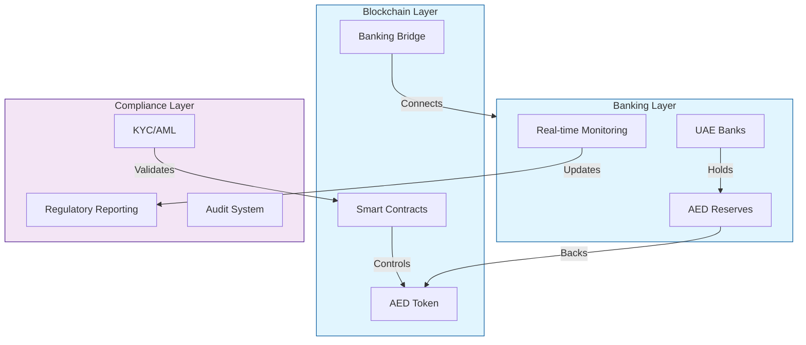
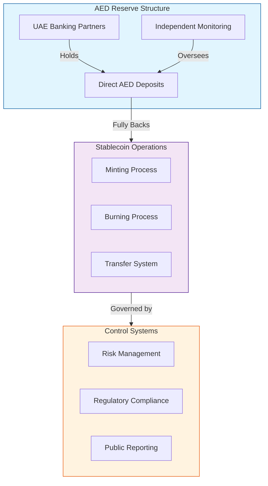
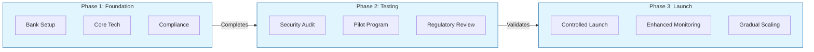

# AED Stablecoin: Design and Implementation Framework

## Core Architecture

The AED stablecoin system consists of three integrated layers:

## Stablecoin Model Analysis

### 1. Fiat-Collateralized Model (Recommended)

This model provides the most stable and regulatory-compliant approach for an AED stablecoin.

Key Implementation Features:
- 100% AED backing in UAE banks
- Multiple banking partnerships
- Independent monitoring
- Monthly attestations
- Public reserve reporting
- Regular security audits

Successful Implementation Examples:

1. USDC (Circle/Coinbase):
   - Maintains 100% reserves in cash and short-term US Treasury bonds
   - Monthly attestations by Grant Thornton
   - Real-world usage: Powers major DeFi protocols like Aave and Compound
   - Daily volume: Over $5 billion
   - Key lesson: Transparency builds trust

2. EUROC (Circle):
   - Euro-backed stablecoin launched in 2022
   - Fully backed by euros in European financial institutions
   - Demonstrates successful regional implementation
   - Key lesson: Regional banking relationships are crucial

3. XSGD (StraitsX):
   - Singapore dollar-backed stablecoin
   - Licensed by Monetary Authority of Singapore
   - Regional success story in regulatory compliance
   - Key lesson: Working with regulators early enables growth

Operational Example:
When a user wants to mint 100,000 AED tokens:
1. User deposits 100,000 AED to designated bank account
2. Bank confirms receipt through API
3. Smart contract mints equivalent tokens
4. Regular audit confirms matching of tokens to reserves

### 2. Alternative Models (Not Recommended)

The following models present significant risks and are not suitable for an AED stablecoin:

1. Crypto-Collateralized
   - Requires 150-200% collateralization
   - Vulnerable to market volatility
   - Complex liquidation mechanisms
   - High technical risk from smart contracts and oracles
   
   Example: DAI's March 2020 Crisis
   - ETH price crashed by 50% in 24 hours
   - Triggered $8.32 million in forced liquidations
   - Required emergency measures to maintain stability
   - Demonstrated vulnerability to market volatility

2. Algorithmic
   - History of catastrophic failures
   - Susceptible to death spirals
   - High manipulation risk
   - Regulatory concerns
   
   Example: Terra/LUNA Collapse (May 2022)
   - $40 billion loss in market value
   - Triggered broader crypto market crisis
   - Failed to maintain USD peg despite algorithmic controls
   - Led to increased regulatory scrutiny globally

## Implementation Roadmap

Implementation Timeline Example:

Phase 1 (3-4 months):
- Week 1-4: Banking partnerships establishment
- Week 5-8: Smart contract development and testing
- Week 9-12: Initial compliance framework setup
- Week 13-16: Integration testing

Phase 2 (2-3 months):
- Week 1-4: Security audit by firms like Trail of Bits
- Week 5-8: Pilot with selected institutional partners
- Week 9-12: Regulatory consultation and adjustments

Phase 3 (Ongoing):
- Month 1: Limited launch with transaction caps
- Month 2-3: Gradual increase in transaction limits
- Month 4+: Full-scale operations with continuous monitoring

Real-world Integration Example:
A UAE trading company using the AED stablecoin for cross-border payments:
1. Company receives USD payment from international client
2. Converts USD to AED stablecoin through licensed exchange
3. Uses stablecoin for instant settlements with local suppliers
4. Suppliers can instantly redeem for AED through banking partners
5. All transactions are recorded on-chain and reportable to regulators

This implementation provides the efficiency of blockchain technology while maintaining the stability and regulatory compliance needed for a UAE dirham-backed stablecoin.
