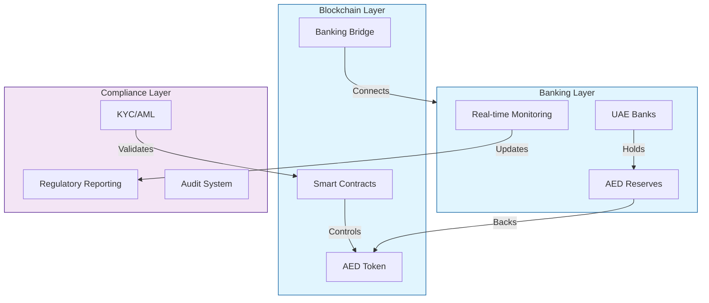
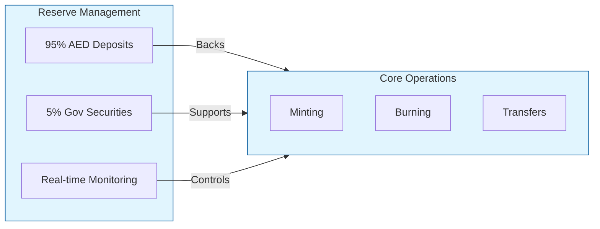
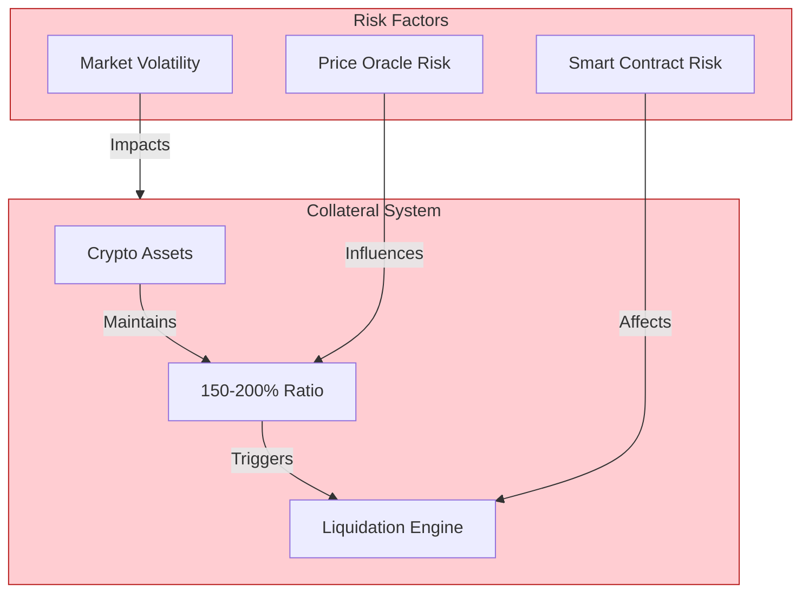
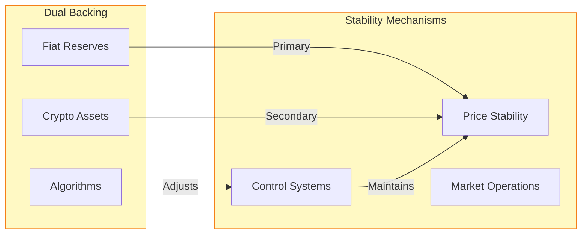
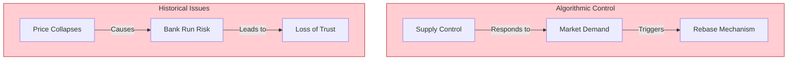
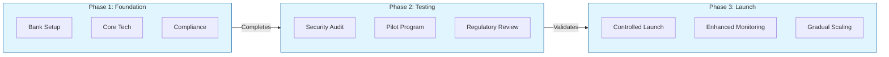

# AED Stablecoin: Design and Implementation Framework

## Core Architecture Overview

## Model Analysis and Real-World Examples

### 1. Fiat-Collateralized Model (Recommended)

Existing Examples:
- USDC (Circle/Coinbase): Backed 1:1 by USD in regulated banks
- USDP (Paxos): Full reserve backing with monthly attestations
- XSGD (StraitsX): Singapore dollar-backed stablecoin
- EURL (Parallel): Euro-backed with French banking integration

Success Factors:
- Regular audits by major accounting firms
- Clear regulatory frameworks
- Banking partnerships
- Transparent reserve reporting

### 2. Crypto-Collateralized Model (High Risk)

Existing Examples:
- DAI (MakerDAO): Multi-collateral system with ETH, USDC backing
- sUSD (Synthetix): Collateralized by SNX tokens
- LUSD (Liquity): ETH-backed with minimum 110% collateral

Lessons Learned:
- Market crashes can trigger mass liquidations
- Oracle failures have caused system instabilities
- Complex governance decisions required
- Higher capital requirements

### 3. Hybrid Model (Medium Risk)

Existing Examples:
- FRAX: Partial collateral with algorithmic ratio adjustment
- VAI (Venus): Multi-asset backed with algorithmic stabilization
- FEI: Protocol controlled value with direct incentives

Challenges Faced:
- Complex interaction between mechanisms
- Difficult to maintain stability in stress
- Higher operational overhead
- Regulatory uncertainty

### 4. Algorithmic Model (Very High Risk)

Existing Examples:
- LUNA/UST (Terra): Collapsed in May 2022
- BASIS: Never launched due to regulatory concerns
- IRON: Partially collateralized algorithmic token that failed
- EMPTY SET DOLLAR: Failed to maintain peg

Key Failures:
- Death spiral scenarios
- Bank run susceptibility
- Market manipulation vulnerability
- Loss of confidence effects

## Implementation Framework

