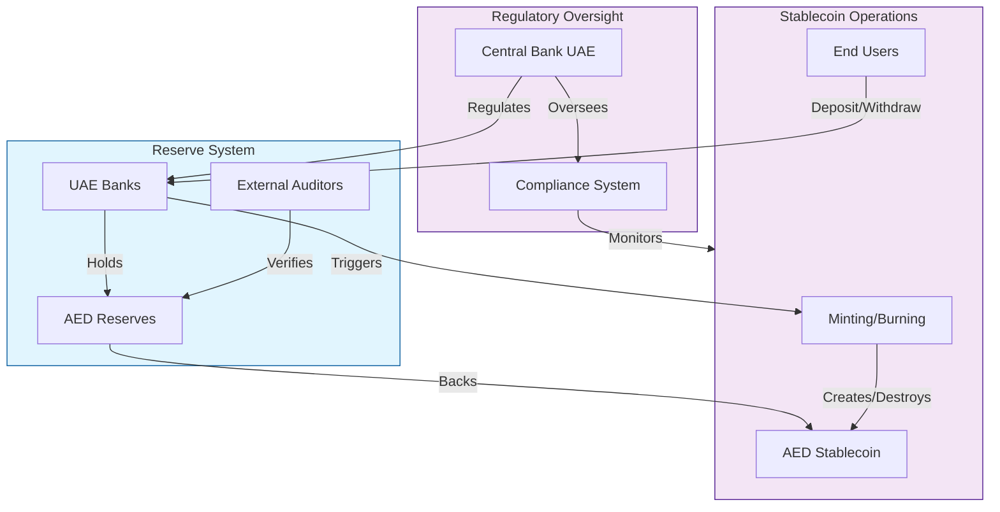
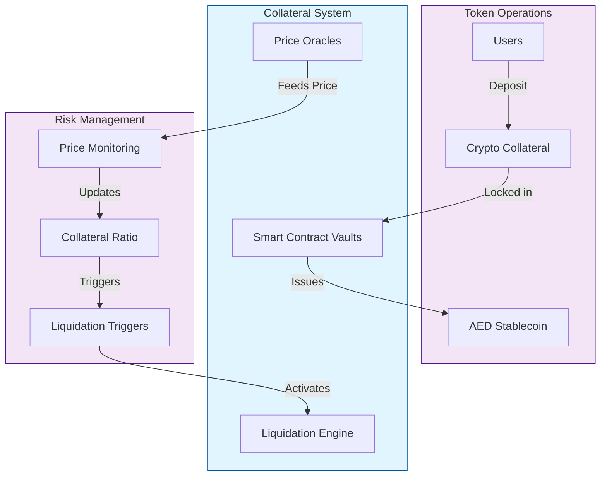
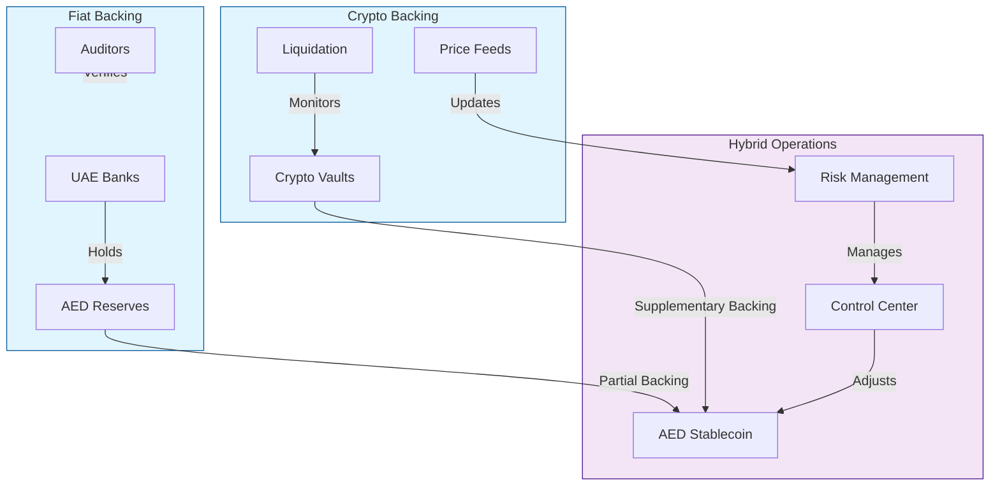
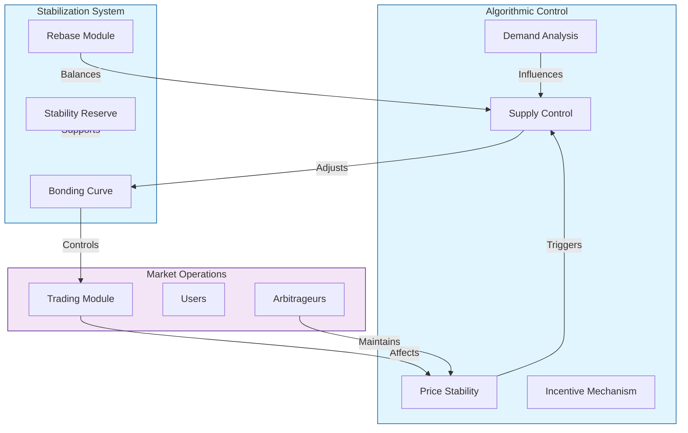

# AED Stablecoin Design Document: Comprehensive Analysis of Models and Implementation

## Introduction

The development of an AED-pegged stablecoin represents a significant opportunity to bridge traditional UAE banking with digital finance. This document explores different stablecoin models, their advantages, and considerations for implementing an AED stablecoin.

## 1. Fiat-Collateralized Model (Proof of Reserve)

The simplest and most straightforward approach involves direct backing by AED held in bank accounts.

### Key Features:
- 1:1 backing with AED in regulated UAE banks
- Regular audits and attestations
- Direct regulatory oversight from CBUAE
- Transparent reserve reporting

## 2. Crypto-Collateralized Model

This model uses cryptocurrency assets as collateral, typically over-collateralized to account for volatility.

### Key Features:
- Over-collateralization (typically 150-200%)
- Automated liquidation mechanisms
- Real-time price feeds
- Smart contract-based operation

## 3. Hybrid Model (Dual-Backing System)

A sophisticated approach combining both fiat and crypto collateralization for enhanced stability.

### Key Features:
- Combined fiat and crypto reserves
- Dynamic collateral ratio adjustment
- Multiple stability mechanisms
- Enhanced risk distribution

## 4. Algorithmic Stability Model

An advanced model using algorithmic mechanisms to maintain the peg.

### Key Features:
- Algorithmic supply adjustment
- Market-driven stability
- Incentive mechanisms for arbitrage
- Dynamic rebasing system

## Recommendation for AED Stablecoin

For an AED-pegged stablecoin, I recommend a hybrid approach with primary emphasis on fiat collateralization. This provides:

1. Regulatory Compliance:
   - Direct oversight from CBUAE
   - Clear reserve management structure
   - Transparent reporting mechanisms

2. Market Confidence:
   - Strong fiat backing for stability
   - Additional crypto collateral for flexibility
   - Multiple stability mechanisms

3. Operational Efficiency:
   - Automated processes for scaling
   - Real-time monitoring and adjustment
   - Quick response to market conditions
