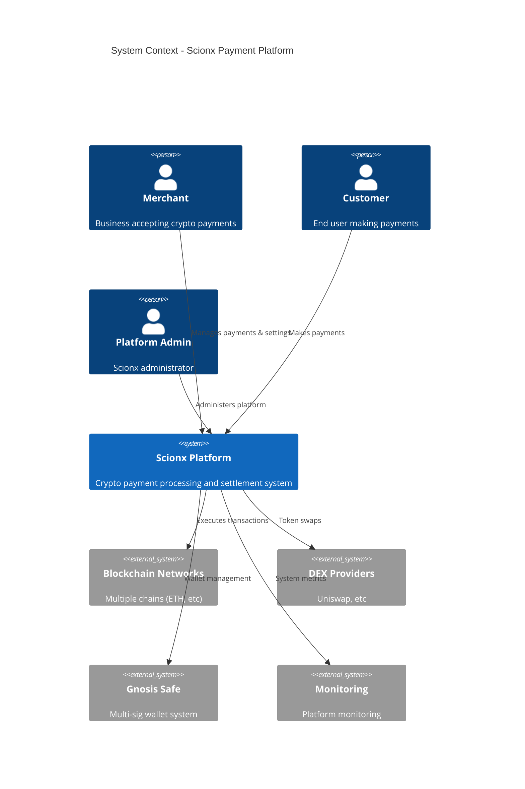
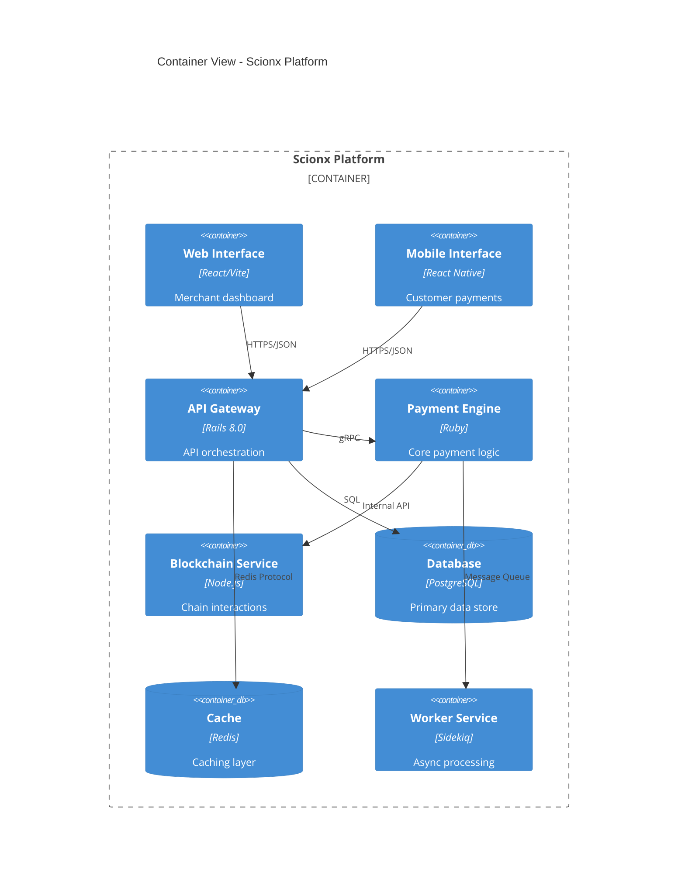
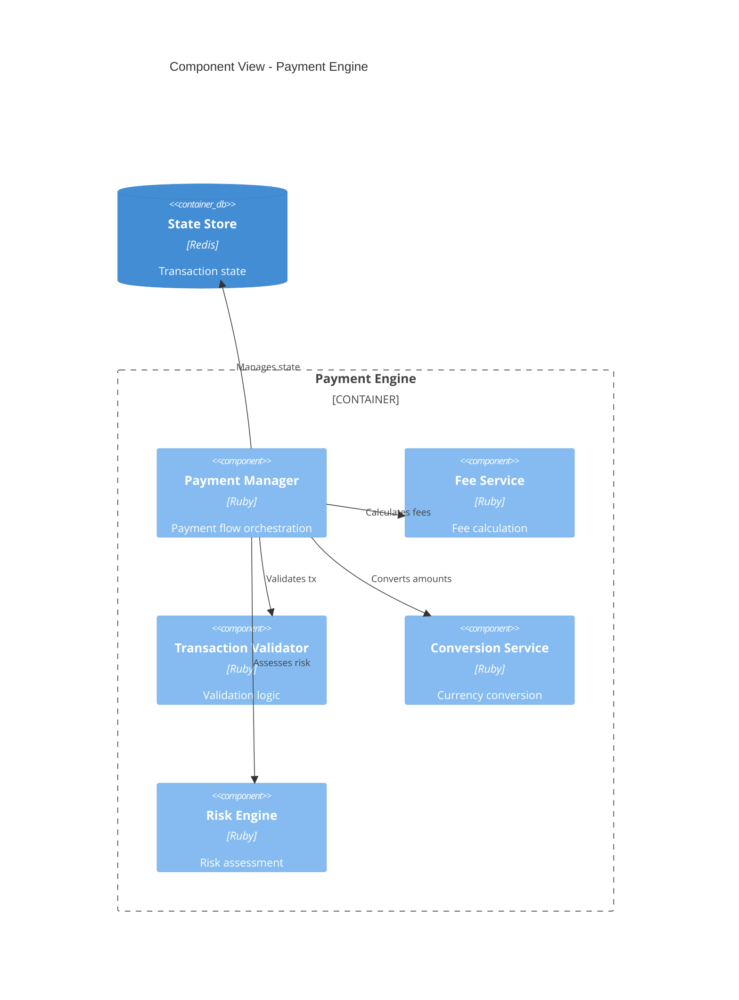
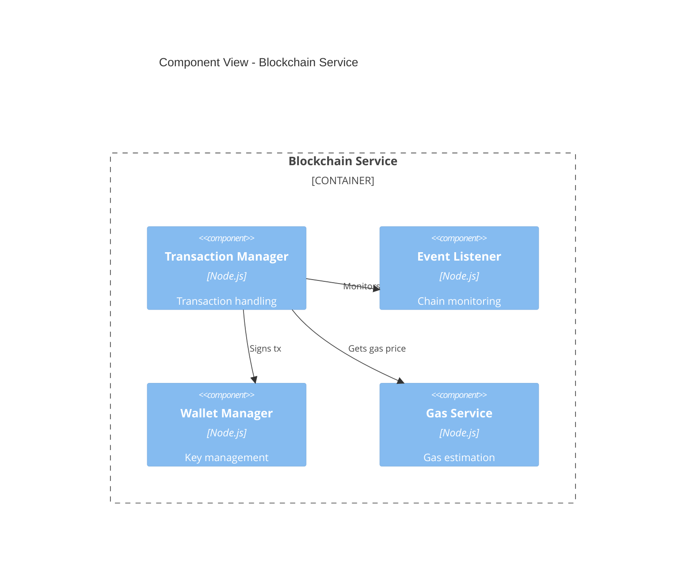
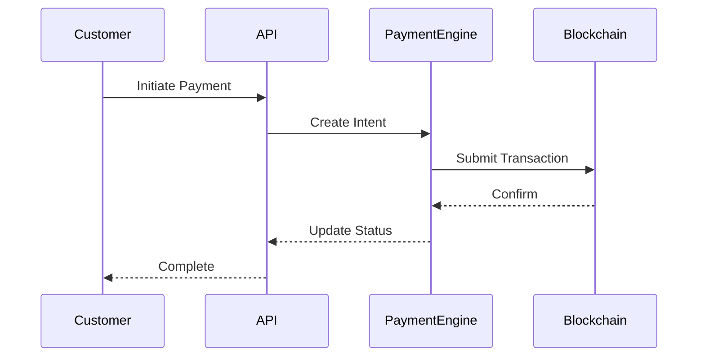
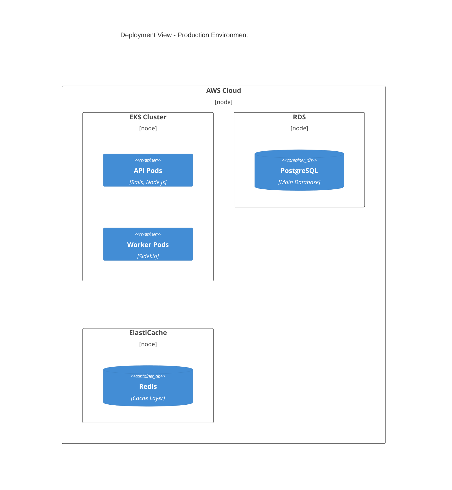

# Scionx Technical Documentation (C4 Model)

## Table of Contents
1. [System Context (Level 1)](#1-system-context)
2. [Container Level (Level 2)](#2-container-level)
3. [Component Level (Level 3)](#3-component-level)
4. [Code Level (Level 4)](#4-code-level)
5. [Supplementary Documentation](#5-supplementary-documentation)

## 1. System Context

### 1.1 Overview


### 1.2 Key Relationships
- **Merchant-Platform**: Payment management, settings configuration
- **Customer-Platform**: Payment execution, transaction monitoring
- **Platform-Blockchain**: Transaction execution, event monitoring
- **Platform-DEX**: Token swap operations
- **Platform-Gnosis**: Multi-signature wallet operations

## 2. Container Level

### 2.1 Container Overview


### 2.2 Container Responsibilities
1. **Web Interface**
   - Merchant dashboard
   - Payment management
   - Analytics views

2. **Mobile Interface**
   - Customer payment flow
   - Transaction status
   - Payment history

3. **API Gateway**
   - Request routing
   - Authentication
   - Rate limiting
   - API versioning

4. **Payment Engine**
   - Transaction processing
   - Fee calculation
   - Currency conversion
   - Compliance checks

## 3. Component Level

### 3.1 Payment Engine Components


### 3.2 Blockchain Service Components


## 4. Code Level

### 4.1 Smart Contract Architecture
```solidity
// Key interfaces and structures
interface IPaymentProcessor {
    struct PaymentIntent {
        address sender;
        address recipient;
        uint256 amount;
        uint256 fee;
        bytes32 id;
    }
    
    function processPayment(PaymentIntent calldata intent) external;
    function refundPayment(bytes32 paymentId) external;
}
```

### 4.2 API Endpoints Structure
```ruby
# Payment Engine API
module API::V1
  class Payments < Grape::API
    resource :payments do
      post do
        # Payment creation logic
      end
      
      get ':id' do
        # Payment retrieval logic
      end
    end
  end
end
```

## 5. Supplementary Documentation

### 5.1 Data Flows


### 5.2 Deployment Architecture


### 5.3 Security Architecture
- Authentication flows
- Authorization matrix
- Encryption standards
- Key management
- Audit logging

### 5.4 Monitoring & Operations
- Health checks
- Metrics collection
- Alert thresholds
- Backup procedures
- Disaster recovery
