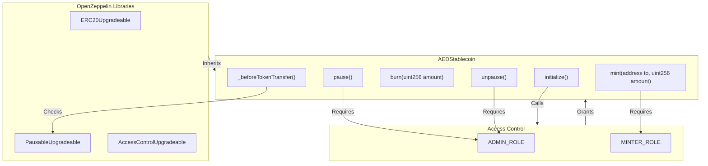
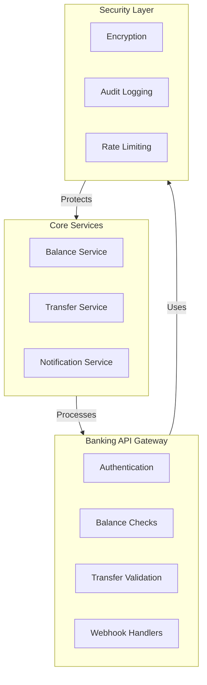
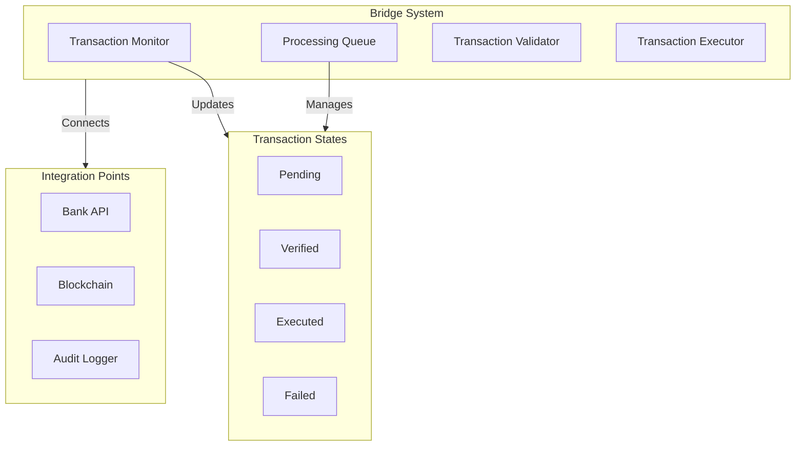
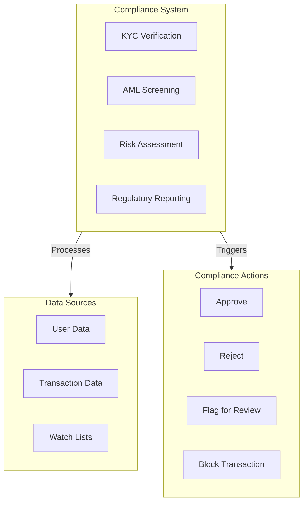
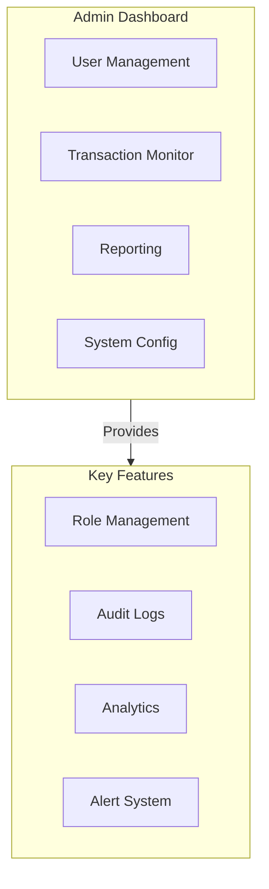
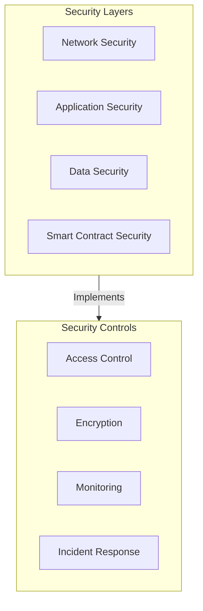

# AED Stablecoin System Technical Specification

## 1. Smart Contract Architecture

### Core Contract: AEDStablecoin

Key Features:
- Upgradeable proxy pattern for future improvements
- Role-based access control for operations
- Pausable functionality for emergency scenarios
- Blacklist capability for compliance
- Full ERC20 compatibility

## 2. Banking Integration Layer

### Banking API Gateway

Features:
- Real-time balance verification
- Secure API endpoints for bank communication
- Automated reconciliation system
- Transaction monitoring
- Audit trail generation

## 3. Bridge System

### Banking-Blockchain Bridge

Features:
- Asynchronous transaction processing
- Automatic retry mechanism
- Transaction state management
- Error handling and reporting
- Real-time monitoring dashboard

## 4. Compliance System

### KYC/AML Integration

Features:
- Automated KYC verification
- Real-time transaction screening
- Risk scoring system
- Regulatory report generation
- Incident management system

## 5. Administration Dashboard

### Management Interface

Features:
- Real-time system monitoring
- User role management
- Transaction oversight
- Compliance reporting
- System configuration

## 6. Security Framework

### Security Architecture

Features:
- Multi-layer security architecture
- Regular security audits
- Penetration testing
- Incident response procedures
- Continuous monitoring
