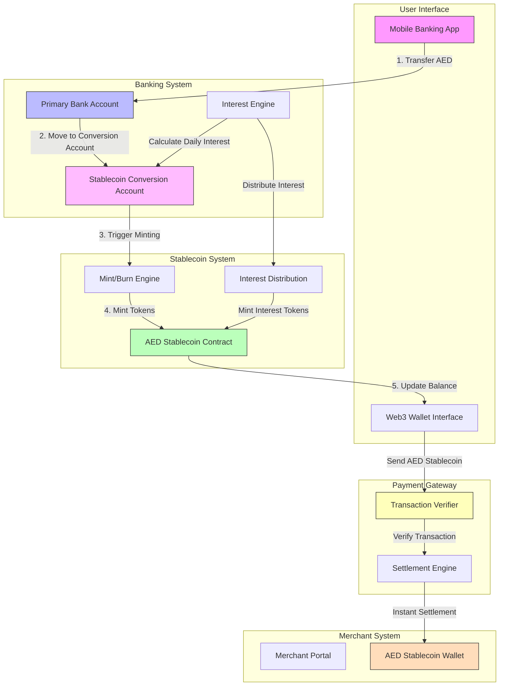

```mermaid
flowchart TB
    subgraph User["User Interface"]
        BankApp["Mobile Banking App"]
        Web3Wallet["Web3 Wallet Interface"]
    end
    
    subgraph BankingSystem["Banking System"]
        MainAccount["Primary Bank Account"]
        SubAccount["Stablecoin Conversion Account"]
        InterestEngine["Interest Engine"]
    end
    
    subgraph StablecoinSystem["Stablecoin System"]
        SmartContract["AED Stablecoin Contract"]
        MintBurn["Mint/Burn Engine"]
        InterestDistribution["Interest Distribution"]
    end
    
    subgraph ScionxGateway["Payment Gateway"]
        PaymentVerifier["Transaction Verifier"]
        SettlementEngine["Settlement Engine"]
    end
    
    subgraph Merchants["Merchant System"]
        MerchantPortal["Merchant Portal"]
        MerchantWallet["AED Stablecoin Wallet"]
    end
    
    %% User Banking Interactions
    BankApp -->|"1. Transfer AED"| MainAccount
    MainAccount -->|"2. Move to Conversion Account"| SubAccount
    SubAccount -->|"3. Trigger Minting"| MintBurn
    MintBurn -->|"4. Mint Tokens"| SmartContract
    SmartContract -->|"5. Update Balance"| Web3Wallet
    
    %% Interest Flow
    InterestEngine -->|"Calculate Daily Interest"| SubAccount
    InterestEngine -->|"Distribute Interest"| InterestDistribution
    InterestDistribution -->|"Mint Interest Tokens"| SmartContract
    
    %% Simple Payment Flow
    Web3Wallet -->|"Send AED Stablecoin"| PaymentVerifier
    PaymentVerifier -->|"Verify Transaction"| SettlementEngine
    SettlementEngine -->|"Instant Settlement"| MerchantWallet
    
    %% Styling
    style BankApp fill:#f9f,stroke:#333
    style MainAccount fill:#bbf,stroke:#333
    style SubAccount fill:#fbf,stroke:#333
    style SmartContract fill:#bfb,stroke:#333
    style PaymentVerifier fill:#ffb,stroke:#333
    style MerchantWallet fill:#fdb,stroke:#333
```
